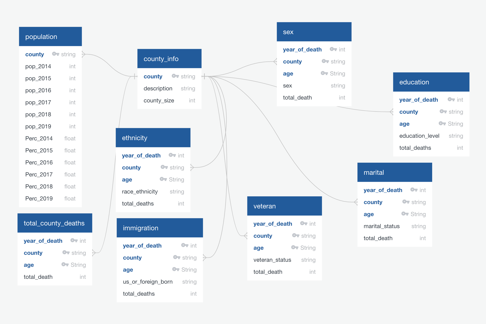
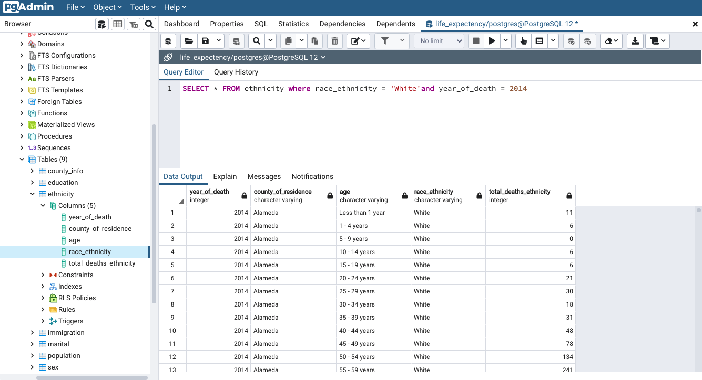

# Factors Related to Mortality and Survival in California Population, 2014 - 2020

*Group members: Bayan Bahloul, Caelan Doherty, Mouad Lachhab, Ryan Lerner & Miaomiao Shen*

## Overview 

In the last few decades, U.S. mortality rates have declined and as a result, life expectancy at birth reached a record high, at 78.8 years in 2019 compared to 69.7 years in 1960 [1]. However, compared to other nations the US had the 20th highest life expectancy in the world in 1960 and 46th in 2019, which is projected to drop to 43rd by 2060 [1]. In addition to that, among developed nations, the 35 OECD countries, U.S. life expectancy at birth ranks at 28 [2].

Much of the available analyses regarding the reduction in mortality rates (increase of life expectancy) focuses primarily on medical innovations and advances in health care. However, there are many other factors that impact mortality that are not studied as closely. Demographic factors such as education level, gender, ethnicity, marital status, place of birth (immigration), veteran status, and urban sprawl could also have an impact on life expectancy. Therefore, this project aims to investigate the relationship of these broad range of factors to mortality and survival in the population of California. The project hopes to shade light on these factors to make the case for policy makers and average citizens to show that beside health-related factors, there may be demographic features that affect these differences in age of death. This study can prove valuable to add to the research on longevity and help find new strategies to ensure a longer and healthier life for future generations in the US and world. The state of California was chosen, given that this state is both heavily populated and diverse, while also containing adequate datasets available to work with.

### Why do we care?
This analysis can certainly be useful not just for government officials in California, but also for everday Californians. California officials can use this information to notice inequalities and potentially allocate resources to account for these inequalities. In addition, citizens of the state can always use this information to estimate the age of their own death. Everyone is going to die at some age, and mortality can often cause humans a fair amount of anxiety. This information can allow people to alleviate their fear of death or even provide some more informed sources for their anxiety.

## Dashboard
https://public.tableau.com/app/profile/caelan.doherty/viz/California_County_Story1/Story1

## Data Source: 

The data used in the analysis reflects information collected and transformed by Viral Records Business Intelligence System (VRBIS) for the State of California in the years 2014–2020. This death data is derived from information entered on death certificates for California residents [3]. 

The income data in this analysis is derived from the United States Census Bureau American Community Survey (ACS) Data for the State of California by county [4]. The ACS does not produce income level information specifically for mortality records, but does contain median income levels for the overall population. Pooling this information with the data from 2014–2020 might provide additional context to estimate life expectancy. 

The death data with underlying causes of death across the states for all U.S. counties is derived from the Centers for Disease Control and Prevention. Data are based on death certificates for U.S. residents [5]. 

## ETL Process

We used python’s Pandas to load the downloaded data. After closely looking at the columns, we decided the drop the columns, ‘Type_of_Event’, ‘Residence_or_Place_of_Death’ 
‘Last_Data_Refresh’, because they don’t bring any valuable information to this analysis.
 
The dataset had all values under 11 as ‘<11’, which is a problem if we want to perform some arithmetic or comparative operation on the data. Therefore, we needed to parse this value on an “int”. Our solution in this case was to average the value to 6 in order to ensure that the death totals were all numerical/graphable. We chose this default value because there are many instances in the table where the death count equals zero. Because 0 did exist in some rows, we could understand '<11' to be greater than 0 and less than 11. Therefore, 6 seemed like an appropriate compromise to place between these two values. 
 
For The ethnicity data, the dataframe had race_ethnicity have “Non-Hispanic” attached to every Non-Hispanic ethnicity. To simplify the data, we used regex drop the “Non-Hispanic” label attached to all non Hispanic ethnicities. 
 
For each table, we renamed the death record column to not confuse the numbers when we will use more than one criteria in a dashboard.
We also created a table that keeps the total number of deaths, not aggregated by any characteristic. 
We created a table that keeps the total number of populations during the same years and how that population breakdown by county, after downloading the data we dropped the years that were outside of scope of this analysis. 
We made a table that shows the counties list and each county’s correspondent surface, and merged it with a table that shows if that county is considered to be a rural, urban or suburban county.
After the cleaning process, the dataframes were exported into a csv file that would be later used to populate our SQL database.

## Database 

### ERD Model

### SQL Database

## Methodology:

First, we will use the Viral Records data from CA to estimate the mortality rate for each age group by county in years 2014-2020 respectively. We would then estimate the overall mortality rate in CA, and with the collaboration of the U.S. census data, compare this to the mortality rate across the U.S in the years 2014–2020 respectively. 

Second, we will analyze the relationship between several demographic factors (sex, race/ethnicity, country of birth, education, marital status, veteran status, and income) and the mortality rate of each age group in the years 2014–2020. With this data, we can predict the trend of mortality rates across the years in CA, and by county. Additioanlly, we would use statistical modelling that includes all the possible factors to predict the life expectancy in CA. There will also be limitations and challenges posed by the data with the possibility of bias, which will be referenced in the final report.

## Machine Learning Model:

After seeing the trends in our dataset, we have decided that the initial focus for our ML model would be using correlation matrices to further quantify the relationship between our variables. we used data grouped by age to see how each criterion maps to the age category on a heat map, then we created a correlation matrix to see how all the other factors relate to each other.
Data preparation:

After transforming the data we tried first a linear svc model and then a trees model but unfortunately neither of them was successful

## **Project Limitation**

1. Looking at the **combined impacts** of different factors would provide a broader insight, however, due to the form of available data, we were only able to look at each factor individually. The California public health data website gave us a query tool, but only allowed us to choose one factor grouped with age bins at a time.
2. **Granularity**: We were unable to find granular data broken down by individual with an exact age of death, so our dataset would only include total death counts in 5-year age bins.
3. **Availability of the data** , it was hard to find datasets for other factors that would be interesting to include in this project, such as income and lifestyle behavior.
4. **Across states**  **comparison** , not all states have the datasets in a unified form that would make it possible to combined or merge them into one to reach the form we need to have it analyzed. Therefore, we limited our project to CA state data and missed the opportunity to compare results across different states.

## Reference

1.	Living Longer: Historical and Projected Life Expectancy in the United States, 1960 to 2060 [https://www.census.gov/content/dam/Census/library/publications/2020/demo/p25-1145.pdf](https://www.census.gov/content/dam/Census/library/publications/2020/demo/p25-1145.pdf) (Accessed: 7/10/2021)
2. 	International Comparison  
[https://www.americashealthrankings.org/learn/reports/2019-annual-report/international-comparison](https://www.americashealthrankings.org/learn/reports/2019-annual-report/international-comparison)(Accessed: 7/10/2021)  
3.	California Department of Public Health Vital Records Data and Statistics, VSB Data and Statistics (ca.gov) https://www.cdph.ca.gov/Programs/CHSI/Pages/California-Vital-Data.aspx
4.	United States Census Bureau, American Community Survey Data, American Community Survey Data (census.gov)        https://www.census.gov/programs-surveys/acs/data.html
5.	Centers for Disease Control and Prevention, CDC WONDER, Underlying Cause of Death, 1999 – 2019, Underlying Cause of Death,1999-2019 Request (cdc.gov) https://wonder.cdc.gov/controller/datarequest/D76;jsessionid=966B85BC1ED23DE79066DD928653
6.	Centers for Disease Control and Prevention, National Center for Health Statistics, Leading Cause of Death, NVSS - Leading Causes of Death (cdc.gov). https://www.cdc.gov/nchs/nvss/leading-causes-of-death.htm

## Communication Protocols

The following collaborative tools are used to facilitate communication and sharing among team members:

- **Slack** For streamline communication, using a private Slack channel as the main communication platform. Beside using it for real-time communication between members, it&#39;s also to share links for resources, schedule meetings, and general announcements.
- **Zoom** For virtual meetings and to share video and screen content between members. It serves as main platform for team to brain, make mutual decisions, give updates on ongoing tasks, and discuss future ones.
- **Google Documents** for team members to take notes, edit, and comment in real time. Also, to keeps record of meetings, assign tasks and track project milestones and deadlines.
- **GitHub** for data repositories that also provide version control, multiple branches, and ability to merge and update. Also serve as the project archives as it allows for all team members permanent access to the project and its resources.
